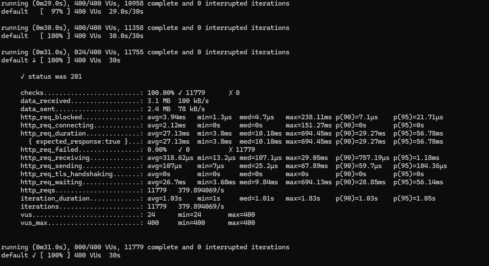

# kafka + spring boot

## kafka topic
```
docker exec -it kafka kafka-topics --create --topic pix-topic --bootstrap-server localhost:9092 --partitions 3 --replication-factor 1
```

## k6 command
```
docker pull grafana/k6
docker run -v C:\Users\pc\Documents\kafka-spring-alura:/scripts -i grafana/k6 run /scripts/k6.js
```
## k6 result



## Resumo dos Resultados
Todos os Requests Bem-Sucedidos: Todas as requisições foram bem-sucedidas, com status HTTP 201.
Baixa Taxa de Falhas: Não houve falhas nas requisições.
Desempenho de Resposta: O tempo médio de resposta é de 27.13ms, o que é bastante eficiente. Os tempos máximos de resposta chegaram a 694.45ms, o que pode ser um ponto de análise para otimização, se necessário.
Alta Carga: O teste foi realizado com um pico de 400 usuários virtuais e foi capaz de lidar com 11,779 requisições em 30 segundos.